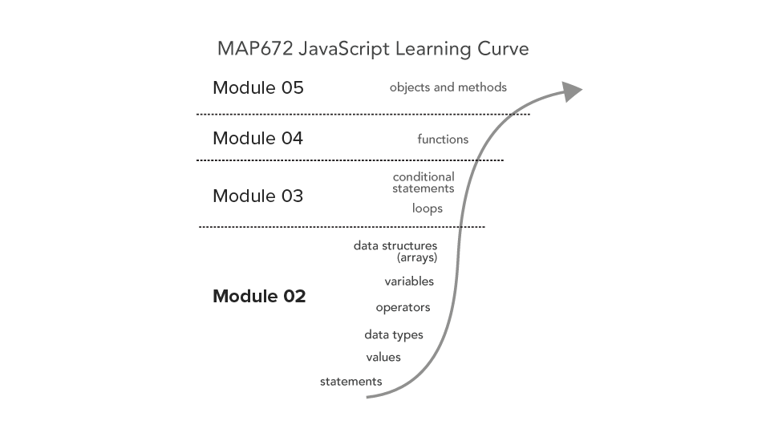
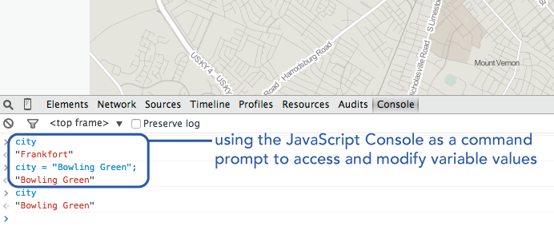
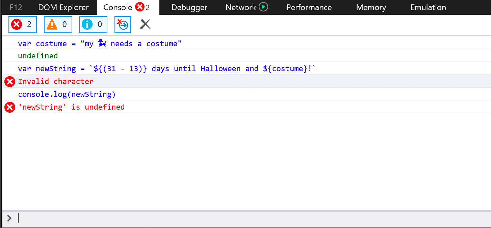

# Lesson 02: The Building Blocks of Programming: Statements, Expressions, Data Types, Operators, Variables, and array Data Structures

## Goals

We will introduce JavaScript and its fundamental data structures. You should be able to encode a string, number, and array data types and compare their values. You will make a map placing markers with popups.

## Table of Contents
<!-- TOC -->

- [Lesson 02: The Building Blocks of Programming: Statements, Expressions, Data Types, Operators, Variables, and array Data Structures](#lesson-02-the-building-blocks-of-programming-statements-expressions-data-types-operators-variables-and-array-data-structures)
    - [Goals](#goals)
    - [Table of Contents](#table-of-contents)
    - [Overview](#overview)
    - [Course Roadmap](#course-roadmap)
    - [Dealing with frustration](#dealing-with-frustration)
    - [Getting started](#getting-started)
    - [The atomic elements of programming](#the-atomic-elements-of-programming)
        - [Values and types](#values-and-types)
        - [Expressions and operators](#expressions-and-operators)
        - [Variables](#variables)
    - [Array data structures](#array-data-structures)
            - [Constructing an array literal](#constructing-an-array-literal)
            - [Accessing array values](#accessing-array-values)
        - [Updating and adding values to an array](#updating-and-adding-values-to-an-array)
    - [If and else conditional statements](#if-and-else-conditional-statements)
    - [Concatenating strings and template literals](#concatenating-strings-and-template-literals)
    - [Code playgrounds](#code-playgrounds)
    - [Conclusion](#conclusion)
    - [Relevant Reading and Additional Resources:](#relevant-reading-and-additional-resources)
    - [Glossary](#glossary)

<!-- /TOC -->

## Overview

In the previous module, we learned how to use HTML to structure our content and how to apply CSS style rules to modify the form and appearance (e.g., color, size, etc.) of content. These two elements, **content** and **form**, and the relationship between them constitute two fundamental aspects of traditional design. Within the web environment, we can introduce a third component to this traditional understanding of design: that of **behavior**, which helps promote user interaction. In web mapping and web development, the behavior of a web page or entities within it is controlled by the programming language JavaScript.

This module begins developing a foundation in computer programming using JavaScript. While we will quickly apply these practices to web mapping, you first need understand the basics of JavaScript and how JS applies to web development more broadly. If you already know a programming language, then you may find these examples easy to pick up.  You'll gain a good understanding of how we use JS in web mapping by applying our specific syntax and recognizing its nuances. If JavaScript is your first programming language, you'll be pleased to know that these fundamentals are not unique to JavaScript and can be applied to the other programming languages as well.

After completing this lesson, you'll be ready to complete [Lab assignment 02](lab-02/).

## Course Roadmap

Take a look at the overall learning curve/trajectory presented in the below graphic. Over the next four modules, we're going to climb the steepest part of the programming learning curve. The terms listed along the curve will become quite familiar to you. These are not unique to JavaScript, but constitute the building blocks of most programming languages.

  
*The JavaScript Learning Curve as instructed in MAP672*

By the end of these modules, you'll be comfortable using the terms listed within this figure and understand how they all relate together to make the program run.

## Dealing with frustration

**A word of caution before we begin:** Learning to program a computer is not easy. A good analogy is that, like learning a spoken or written language, you have first to learn its general grammar and the particular syntax with which we write the code. Then you go out and make a fool of yourself by incorrectly formulating sentences. Great fun!

Unfortunately, computers aren't as forgiving for small mistakes as when practicing a spoken or written language. We need to be very careful when we write our code, and as often as we can, write the code **precisely as the examples do.** Pay close attention to whether there are spaces, underscores, capital letters, and semicolons in a line of code. Uppercase and lowercase letters do matter. Even one wrong character may produce an error and break your script!

However, the good news is that writing bugs into our programs and generating errors is an essential part of learning both to program and programming itself. Why is this good news? First, we can feel okay when we don't write perfect code the first time because no one does. Second, programmers have developed strategies for identifying and fixing these bugs. We'll be explicitly teaching you these strategies, as well. Sometimes the computer tells us what went wrong (which error did we make?). Sometimes we don't know what went wrong.  Remember, making errors and figuring how to fix these errors (what we call "debugging") is simply part of programming itself. All programmers, no matter their expertise, unintentionally write errors and spend countless, frustrating hours debugging that code.

Be prepared for your program to break. Be aware that you will become frustrated (and even angry at your machine) and then confused about the first steps to fix it. We expect it. The best way to learn how to program is to do it. Let's get started, shall we?

## Getting started

Open the *module-02/* directory in your text editor of choice. Then open the *lesson-02/index.html* Lesson 02 Starter template. Follow along with the lesson instructions, writing JavaScript code (toward the bottom of the document between the `<script></script>` tags) from the examples. You can comment out this code as you proceed through the lesson.

Save this file, entering commit messages as you work, and synchronize it with the remote periodically and then finally to submit. **This will constitute 1 pt or 10% of your Lab 02 assignment grade.** See the [*Lab 02* assignment](lab-02/). Please be sure to read the lab for exact requirements.

Let's get started learning to code with JavaScript!

## The atomic elements of programming

When we write JavaScript code, we write ***statements***. Statements are like spoken or written sentences within computer programming. To make the computer do something, we have it execute a statement. To begin, let's first write a statement that prints a message to the JavaScript Console. Statements in JavaScript end with a semicolon. Write the following statement in your index.html file (or any convenient file) within the `<script></script>` tags, which are located toward the bottom of the HTML document within the `<body></body>` tags:

```javascript
console.log("hello map");
```

Save the file and refresh your browser to check the output in the JavaScript Console. We should see our message there.

**Note:** Get used to these steps. You'll be repeating this process indefinitely as you write code to develop web maps and applications:

1. edit the code in your code editor
2. save the file
3. refresh the browser to view output in the browser or the development tool/Console

We'll be making and testing maps with this development process.

### Values and types

When we logged the text "hello map" to our browser's JavaScript Console above, the "hello map" text string is considered a ***value***. Values are the bits of data that we wish to encode, manipulate, and represent within our maps and data visualizations. They're the whole point of why we're mapping! But not all values are the same.

In JavaScript, our values have different **types**. Remember the quotations around the text *hello map* in the previous example? The quotations indicate that our value of *hello map* is a **string**  type. A string type means it is text, and JavaScript will treat it like text rather than something else, such as a number. Note that you can enclose String types with either single or double quotation marks (but if you begin a String with a single quotation, it must end with a single quotation; an opening double quotation needs to end with a closing double quotation mark).

```javascript
console.log('hello map');
```

Try taking out the quotations around *hello map*, save your file, and refresh the browser. You will see an error in the Console because, with that small change, JavaScript no longer knows that this is a String type.  Be sure to fix this before going on. Statements written below one that throws an error will not likely not execute.

**Be sure that your code is error-free** (i.e., there are no errors displayed in the Console) before continuing to edit your code or develop your program. **This is critical.**

A couple of other examples will help us understand that values have different types.

Next, write in the following statement, save your changes, and refresh your browser:

```javascript
console.log(5);  // output is 5, a numeric type
```

You should see the number 5 output in the Console. The value 5 is, not surprisingly, a ***numeric data type***. We notice that the value *5* does not have quotation marks around it, and therefore is not a string type. However, if we enclosed the number 5 within quotation marks, it would be a String type (a textual representation of the number five).

```javascript
console.log('5');  // output is 5, a String type
```

JavaScript can also handle fractional numbers using a decimal point, as well as exponents:


```javascript
console.log(5.5); // output is 5.5
console.log(5e10); // output is 50000000000
```

Be careful when writing numeric values NOT to use commas in long numbers. The computer will not interpret it as a single number, but rather as two or more numbers (or will throw an error, depending on the context).

```javascript
console.log(564,352) // output is 564 352
```

We encode much of our geographic data either as text (i.e., string types) or numbers (i.e., numerical or number types). This distinction may seem simple and obvious now but can wreak havoc if you are not careful. So, always pay attention to your *type* of data!

Another value we frequently use when programming is that of the **boolean** (or logical) type, which is used to represent either true (also represented by the number 1) or false (represented by the number 0). The keywords *true* and *false* have special meaning in JavaScript, and if we include them without quotes, they are treated as boolean value types. Test the following statements:

```javascript
console.log(true);
console.log(false);
```

Note that these are different value types than if we wrote those words as string types:

```javascript
console.log("true");
console.log("false");
```

Test your understanding: what is the difference between `console.log(true);` and `console.log("true");`?

### Expressions and operators

Numbers and strings may look somewhat similar when printed to our JavaScript Console. For example, the numeric value of 5 and a string value of "5" look very similar to us, but the computer interprets these as very different. To explore this, we'll introduce another programming term, the ***operator***. What is an operator? Quite simply, operators perform operations on values. In other words, they *do things to values*.

We're already familiar with such operators as we use in basic mathematical **expressions**. An expression is JavaScript code that uses operators to resolve one or more values to a new value.

Write this code in your file, save, and refresh the browser to see the output in the Console:

```javascript
console.log(5 + 8); // output will be 13
```

The plus sign in this example is an operator that forms an expression, which in this case, adds the two numeric values together. The value of this expression, 13, is a numerical type. We have just turned the computer into a very expensive calculator! Progress!

Read more about [arithmetic operators](https://developer.mozilla.org/en-US/docs/Web/JavaScript/Guide/Expressions_and_Operators#Arithmetic_operators) and [JavaScript Operators](http://www.w3schools.com/js/js_operators.asp).

In addition to basic **arithmetic operators** (i.e., for addition, subtraction, multiplication, division), we often use **comparison operators**, which compare values and return a boolean value of either true or false.

Log the following expressions to your browser's Console:

```javascript
console.log(5 < 8); // evaluates to true
console.log(5 > 8); // evaluates to false
console.log(5 == 8); // evaluates to false
console.log(5 != 8); // evaluates to true
```

Read more about [comparison operators](https://developer.mozilla.org/en-US/docs/Web/JavaScript/Guide/Expressions_and_Operators#Comparison_operators).

Note that we can also use operators on string types:

```javascript
console.log("My name is " + "Vance Alligator");
```
Type this in the console, and you will see it outputs `My name is Vance Alligator`. The plus sign, when used as an operator on string types, behaves differently than on numeric types. Rather than performing a mathematical calculation, the plus sign operator joined, or **concatenated**, the two string values into a single string value.

This is an essential idea so, let's repeat this to be clear: **operators behave differently on different data types.** A plus sign operator will result in a different outcome when applied to string values than numeric values.

To make things even more confusing, we can apply operators to two different values, such as a string and a numeric value. Log the following expression to your console, which uses the plus sign operator between a numeric and string value:

```javascript
console.log(5 + "8"); // output is 58
```

Why is this result 58? This may not be what we expected. Rather than adding these two different types (a number and a string), JavaScript first converts the numeric value of 5 into a string type, and then concatenates the two together, resulting in a string value. Dynamically reassigning the data type of a value is known as **type conversion**. We also say that the numeric value of 5 is **cast** a number. This terminology is quite specific, so practice using it correctly.

The previous example is one instance, when paying attention to data types is essential. Say we had a more complex program that was loading in more massive datasets, and we wanted the script to aggregate some totals. If we encoded one data set as numbers and the other as string types, the program would go ahead and produce the wrong results! We may not even notice because this type of error is not a **syntax error** that breaks the script. This type of error is more dangerous than syntax errors because the script still runs but produces erroneous results.

The point, again, is that JavaScript operators can convert data types. Note the same thing happens in this example, though it is more clear what has happened:

```javascript
console.log(5 + "hello map"); // output is a string value "5hello map"
```

The number 5 has been converted to a string representation of "5".

What happens when we apply our comparison operators to this case of mixed data types? Consider the following output:


```javascript
console.log(5 < "8"); // output is true
console.log(5 > "8"); // output is false
console.log(5 == "5"); // output is true!?!?!
```

The first two make sense to us. But how is the third true? When comparing a number and a string, JavaScript again converts the string to a number to make the comparison.

This makes sense then, regarding these three examples because the expressions are evaluating those values as numbers. So while the arithmetic operator (the `+` sign) converted the number to a string, the comparison operator (`<` or `>`) converted the string to a number!

Read more about [data type conversion](https://developer.mozilla.org/en-US/docs/Web/JavaScript/Guide/Values,_variables,_and_literals#Data_type_conversion) in JavaScript.

Take particular note with the third example above. In JavaScript and most programming languages, we can use a double equals sign `==`  when we want to test if two values are equivalent.  A single equals sign `=` is used as a different operator (an assignment operator, as discussed below), and mixing this up will cause problems.  

However, if we need to compare a number with its string type equivalent, use a three-character equals sign `===`. **It's often a good idea to test for equality using the three-character equals sign `===`.**

```javascript
console.log(5 == "5"); // output is true
console.log(5 === "5"); // output is false
```

There is a third category of operators that we regularly use. Logical operators consist of AND (`&&`), OR (`||`), and NOT (`!`).

Consider the following statements using logical operators of AND and OR:

```javascript
console.log(1 < 2 && 2 < 3); // output is true because 1 < 2 and 2 < 3
console.log(1 < 2 && 2 > 3); // output is false because the second statement (2 >3) is not true
console.log(1 < 2 || 2 > 3); // output is true because only one of the statements need be true
```

The NOT operator is usually prepended to a value to incur its opposite. We also use it to determine if a value is NOT equal to another value:

```javascript
console.log(!true); // output is false
console.log(1 != 2); // output is true because 1 is NOT equal to 2
console.log(1 != 1); // output is false because 1 is equal to 1
```

So far, we've learned the most fundamental aspects of programming. To recap:

1. We write statements in JavaScript and end these statements using a semicolon.
2. Statements are composed of values, which have a specific data type (so far, either strings, numbers, or boolean types).
3. We use expressions to perform operations on values types or to compare values.

### Variables

So far, all these `console.log();` statements only log values out to the Console each time we re-run the program. In programming, however, we need a way to store these values as the script runs. **Variables** help us track of values while the script runs. To be more precise, variables are not the values themselves, but instead, they allow us to store references to values.

We *declare* a new variable using the JavaScript keyword *var*. We do this with a simple statement:

```javascript
var city;  // declaring a variable named city
```

While you can use almost anything for a variable name, it is important to choose names that are semantically meaningful and useful within the program. Choose names that describe the value to which they refer. After all, calling a variable `map` rather than `dasf3432489jfff` gives you (and anyone else reading the code) a much better sense of what role the variable plays in the program.

**Important:**, variable names **can not begin with a number**, and **cannot be one of JavaScript’s reserved keywords**. The following keywords are used elsewhere in JavaScript and should not be used as a variable:

<blockquote>
break case catch class const continue debugger
default delete do else enum export extends false
finally for function if implements import in
instance of interface let new null package private
protected public return static super switch this
throw true try typeof var void while with yield
</blockquote>

It is useful to keep some basic things in mind when choosing variable names. While you can use underscores or hyphens in variable names, the general convention is to use what’s known as **camelCase**. That is, the first letter of the variable begins with lowercase, and subsequent words within the variable name are concatenated together without using spaces and capitalized (**do not use spaces within variable names!**). The following variable declarations illustrate the use of camelCase to write semantically meaningful variable names:

```javascript
var city;
var myCity;
var myFavoriteCity;
var myFavoriteCityInTheWorld // Although descriptive, it is getting a bit long
```

After declaring the variable, we can then **assign** a value to that variable by using a single equals sign, `=`, an *assignment operator*  through the following expression:

```javascript
var city;  // declaring a variable named city
city = "Lexington"  // assigning a string value to the city variable
console.log(city);
```

**Note:** This is how a single equal sign `=` differs from a double equal sign `==`. Also, the variable name must always be written to the left of the *=* sign, and not the other way around.

Note that when we declare an empty variable with the statement `var city;`, the variable is not referencing any particular value data type. Once we assign a string value to it, it is referencing a string value.

We can also declare a variable name and assign a value to it within a single statement (which is often more common and efficient):

```javascript
var city = "Frankfort";  // declaring and assigning a string value in a single statement
console.log(city);
```

Let’s practice declaring more variables and assigning values of various types to them. Type the following JavaScript code in your *index.html* file, save the file, and refresh your browser to see the results. Get used to this process, as we’ll be doing it a lot while we develop web maps!

```javascript
var city = "Frankfort";
var state = "Kentucky";
console.log(city + ', ' + state);
```

Note that in this third statement, we logged 3 values to the Console. The second value was a string representation of a comma and a space, which improves the readability in the Console output. 

What if we had a string variable that needed quotes or a line break? We all know that Lexington, Kentucky is the "Horse Capital of the World!" and assigning this value to a variable has a few options.

```javascript
// use the escape \ backslash character
// this removes the special meaning of characters
var city = "Lexington's residents all say, \"We're the horse Capital of the World!\""; 
```

The `\` backslash character is a special character in many programming languages. It is called the *escape* character that removes or adds special meaning to the character immediately following the `\`. Using it in front of a quote removes the special meaning of quotes in string variables. 

```javascript
// use the escape \ backslash character
var city = "Lexington's residents all say, \"We're the Horse Capital of the World!\""; 
```
We can use the backslash to continue statements on additional lines, say in a long string assignment. Below, the backslash precedes a line break and ignores the otherwise meaning this has, i.e., end of the statement.

```javascript
var city = "Lexington's residents all \
say, \"We're the Horse Capital of the World!\" \
This is certainly true because of Keeneland Racetrack."; 
```

We often assign the value of an expression to a variable name, as well. Write and test the following statements:

```javascript
var total1 = 15 + 20;  // result of the expression is assigned to variable
console.log(total1);

var value1 = 30;
var value2 = 60;
var total2 = value1 + value2;  // expression references variables and assigned
console.log(total2);

var average = total1/total2;
console.log(average);
```

We can also change the value (or re-assign) the value referenced by an existing variable. This characteristic of JavaScript makes it what's known as a **dynamically typed** (sometimes referred to as "weakly typed") programming language. We compare this to other languages that are **strongly typed** in which the code can not change the data type of a variable assignment after it's created.

```javascript
var year = 2015;
console.log(year);  // year references a number value
var year = "fabulous!";
console.log(year);  // year now references a string value
```

Also note that when we `console.log()`, we sometimes include expressions using multiple data types within it, separated by commas, such as writing a string and then following that with a value referred to by a variable:

```javascript
var cityPop = 308428;
console.log("The population of Lexington is ", cityPop);
```

The comma, in this example, is not operating on the string and numeric value. Instead, they are simply written to the console. 

Just a quick note here that our JavaScript Console is more than just an output field for using the console.log() statements within our script. We can also use the Console as an interactive command prompt itself, which has access to the internal state of the script as executed within our HTML document. So, for example, if we’ve declare and defined such variables as `city` or `cityPop`, as demonstrated above, within our script (and refresh the browser), we still have access to these values within the JavaScript Console.

Try typing the word `city` within the browser's Console. We see the value logged within the Console. We can also change the value of these values as well, for example, by typing `city = "Bowling Green";` This changes the value of the variable named `city` to a new string value.

  
*Using Console as command prompt*

Finally, note that we can declare multiple variables in a single statement using a single `var` keyword by separating them with commas:

```javascript
var city = "Boulder",
    state =  "Colorado",
    population = 103166,
    zipCodes = [80301, 80303, 80305, 80307];
```

You'll often see this shorthand used in JavaScript code and is the same thing as writing: 

```javascript
var city = "Boulder";
var state =  "Colorado";
var population = 103166;
var zipCodes = [80301, 80303, 80305, 80307];
```

When declaring multiple variables separated by commas using a single statement, you often want to group logically related variables in this way. 

## Array data structures

We just learned how to assign values to variables to store for later use in the program. While individual variables are useful, often, we wish to store larger groups of values together. In computer programming, we use **data structures** to organize data in predictable ways so the computer can efficiently work with these data. We'll be using two data structures in this course: arrays (the current module) and objects (module 05).

An array is a data type that organizes other values as an ordered list (i.e., the order of the elements in the array is important, as we'll see). We can then assign the array itself to a variable; in the same way we assign other values to variables.

#### Constructing an array literal

Arrays can be constructed using what's known as an **Array literal**, that is, we *literally* define the array's values using square brackets `[]`. We can create an empty array and assign it to a variable we call cities with the following JavaScript code:

```javascript
    var cities = []; // creates an empty array
    console.log(cities);
```

We can also construct an array with values (in this case string values that are city names) as the list items:

```javascript
    var cities = ["Frankfort", "Louisville", "Lexington"];
    console.log(cities);
```

Arrays accept any values within it as list items. So, for instance, instead of constructing an array of string values, we could build one with numbers:

```javascript
    var populations = [25527, 756832, 308428];
    console.log(populations);
```

The values within an array don't need to all be the same type. We could build an array of various data types. In this case, a String value, a numeric value, and a Boolean value:

```javascript
    var populations = ["Frankfort", 756832, false];
    console.log(populations);
```

Arrays can even contain other arrays! In this way, we can create what's known as a "multidimensional array," or a "2-D" array, which can start to look fairly complicated:

```javascript
    var cityData = [
        ["Frankfort", "Louisville", "Lexington"], // array of strings
        [25527, 756832, 308428], // array of numbers (populations)
        [true, false, false] // array of booleans
    ];
    console.log(cityData);
```

In this example, we would say that the variable `cityData` references an array which contains three elements. Each of these three elements happens to be an array comprising three elements, each of different data types.

#### Accessing array values

How do we access individual values within an array? As we said above, arrays are an ordered list. This order is important because each item in the array has an **index value** (i.e., its specific place within the array). We access individual index values using the name of the array and square brackets, e.g., *ArrayName[indexValue]*, which is what's known as **bracket notation**.

**Here's the tricky part, so pay attention to this!** The first index value of an array is always zero, not one! Read more about [zero-based numbering](http://en.wikipedia.org/wiki/Zero-based_numbering).

To access the first item within an array, we'd use the following syntax:

```javascript
    var cities = ["Frankfort", "Louisville", "Lexington"];
    console.log(cities[0]); // outputs the String "Frankfort"
```

Logically then, we can access the other values using their respective index values. However, if we attempt to use an index value that doesn’t exist, Javascript cannot find a value and therefore, will output another data type, called *undefined*. JavaScript is quite flexible in this way; it is nice that it doesn’t throw an error and break the program in this case!

```javascript
    var cities = ["Frankfort", "Louisville", "Lexington"];
    console.log(cities[0]); // outputs the String "Frankfort"
    console.log(cities[1]); // outputs the String "Louisville"
    console.log(cities[2]); // outputs the String "Lexington"
    console.log(cities[3]); // outputs undefined data type
```

What about that 2-dimensional array that we wrote above? How do we access values within such nested arrays? For this, we use a double bracket syntax, i.e., *ArrayName[indexValue][indexValue]*. For example:

```javascript
    var twoDArray = [
        ["Frankfort", "Louisville", "Lexington"],
        [25527, 756832, 308428],
        [true, false, false]
    ];
    console.log(twoDArray[0][2]); // output will be Lexington
    console.log(twoDArray[2][1]); // output will be false
```

In this example, the first bracket number indicates which array to access, and the second bracket number indicates which value in this array to look at.  Remember, the numbering system of the index values starts with zero!

### Updating and adding values to an array

Now that we know how to make an array and access its values, we need to understand how to update values within an array and add additional values to it. Let’s say we’ve created an array of numeric values representing years:

```javascript
    var years = [2010, 2011, 2022, 2013, 2014];
    console.log(years);
```

We notice that we’ve entered the wrong value for the third element in that array. Sure, we could fix it in the array definition within our script. But let’s pretend we want to update the array programmatically (we’ll need to do this in more complex and dynamic programs). To do so, we use the same syntax as when accessing an element of an array through its index (square brackets), but now we use the assignment operator to give that index  a new value:

```javascript
    var years = [2010, 2011, 2022, 2013, 2014,2015];
    console.log(years);
    
    years[2] = 2012;  // accessing a value and reassigning it
    console.log(years); // we can see that the array has been updated!
```

How do we add additional values to our array? We can do this in the same way as we update our array with the square brackets and assignment operator. For example:

```javascript
    var counties = [];
    console.log(counties); // output is an empty array
    counties[0] = "Adair";
    console.log(counties); // output is a single item array ["Adair"]
    counties[1] = "Allen";
    console.log(counties); // output is now ["Adair", "Allen"]  
```

What happens if we create a value at an index value beyond the current length of the array? Try it and see!

```javascript
    counties[5] = "Anderson";
    console.log(counties); // what is this output?  
```

We build the array to now hold four items, and "Anderson" is added to the end of the sequence of elements (remember the first index is zero!), and the undefined values have been given index values.

The array is an important data structure and one you'll be using extensively within your JavaScript coding and mapping applications. Read more about the [JavaScript array object](https://developer.mozilla.org/en-US/docs/Web/JavaScript/Reference/Global_Objects/Array).

## If and else conditional statements

Currently, when we run our JavaScript within the browser, the statements execute from top to bottom. This is a normal flow of execution in programming, as we can think of the browser interpreting the script from top to bottom. However, more advanced scripts do not follow a simple top to bottom flow. **If and else statements** are used to disrupt this normal flow.

The syntax of an if statement looks like the following. Study the placement of the parentheses and curly braces carefully:

```javascript
if(expression) {
    // do something
    // do something else
}
```

While the whitespace and return characters separating the three lines do not matter for the computer, we write these statements in this way to improve readability.

1. First the statement `if` (a reserved special keyword in Javascript),
2. followed by an opening and closing parentheses containing an expression that evaluates to either true or false,
3. followed by block statements contained within curly braces.

If the expression evaluates to true, the block statements within the two curly braces are executed. If the expression evaluates to false, then statements within the curly braces are not executed, and the script continues to run below the statement.

For instance:

```javascript
var temp = 32;  // declaring a variable and assigning a number value

if(temp === 32) {  // if the value of `temp` is equal to 32
   console.log("the temperature is freezing");  // then log the string to Console
}
```

Because the number 32 is equivalent to the value of `temp`, the expression `temp === 32` evaluates to true and the console.log() statement within the braces is executed. Again, pay attention to how a single equal sign is used `=` to assign a value to a variable, and a triple equal sign is used `===` to test if two things are equal.

Try changing the value of `temp` to 33 and running the code again.

```javascript
var temp = 33;
if(temp === 32) {
   console.log("the temperature is freezing");
}
```

There is no output! But the program has run successfully. The conditional expression evaluated to false, and therefore the statements within the curly braces did not execute. However, it'd be nice if we knew this. Let's include another statement, the *else* statement. Else statements follow an *if* statement.

```javascript
var temp = 33;
if(temp === 32) {
   console.log("the temperature is freezing");
} else {
    console.log("the temperature is NOT 32, but still may be freezing");
}
```
In this case, the conditional statement evaluates to false, and the code within the `else` block statement runs, rather than within the `if` block statement.

Often we want to test more than one condition before executing the  `else` block statement. We can add subsequent *else if* statements after the first `if` statement and before a final *else* statement. The comments within this example help explain how the if, else if, and else statements work.

```javascript
var temp = 33;
if(temp <= 32) {
    console.log("the temperature is freezing");
} else if(temp > 32) {
    console.log("the temperature is above freezing");
} else {
    console.log("the value of temp must not be a number");
}
```

Of course, we'll be doing more within the block statements than logging to the Console. For instance, we could assign a variable a value:

```javascript
var temp = 33,
    report = undefined; // first assign report an undefined value

if(temp <= 32) {
    report = "The temperature is freezing.";
} else if(temp > 32) {
    report = "The temperature is above freezing."
} else {
    report = "Not sure how you measure temperature."
}

console.log(report)
```

We'll be using if/else statements in this week's lab assignment and returning to use them in looping structures in Module 04.

## Concatenating strings and template literals

As we dynamically create content (e.g., for popups), we will rely on combining bits of data into readable strings. As we have discovered this is called *concatenation*, and we can use the addition `+` operator on string literals, expressions, and variables. In the example below, we are combining an expression `(31 - 13)`, a string literal, and a variable.

```javascript
var costume = "my 🐩 needs a costume"
var newString = (31 - 13) + "days until Halloween" + costume
console.log(newString)
```

The Console should print the following.

```js
18days until Halloweenmy 🐩 needs a costume
```

We have a number of issues with formatting that make the string slightly annoying, e.g., missing spaces between words and no punctuation. We can add the spaces and new variables in a somewhat verbose fashion. 

```javascript
var costume = "my 🐩 needs a costume"
var space = " "
var period = "."
var and = "and"
// Build string without altering the original data
var newString = (31 - 13) + space + "days until Halloween" + space + and + space + costume + period
// Alternative version that changes the string literal
var altVersion = (31 - 13) + " days until Halloween and " + costume + "."
console.log(newString)
```

OK, we fixed the problem with two versions. The syntax relies on the addition `+` operator to concatenate every bit of data into a single string. But, it's also a math operator and can be used in the same statement. Confusing? Of course, it is! 

Wouldn't it be easier to remove the `+` string operator and *embed* your variables and expressions in a string? We can use the [*template literals*](https://developer.mozilla.org/en-US/docs/Web/JavaScript/Reference/Template_literals)  (often called *template strings*) to make string concatenations more easy to read and construct. In this method, the `+` operator will always be recognized as a math operator.

In the traditional method of declaring a string, we've enclosed values in single or double quotes. A template literal uses the backtick, \` (which is the key to the left of the number `1` key), to enclose the string. To embed variables and expressions in the string, wrap them in the dollar sign and curly brackets, `${ }`. The above statement would be rewritten as:

```javascript
var costume = "my 🐩 needs a costume"
var newString = `${(31 - 13)} days until Halloween and ${costume}!`
console.log(newString)
```

Much easier to read! You will find that constructing template literals will be more concise and easier to manage than traditional string concatenation with the `+` operator. This feature was adopted in the JavaScript standard defined in JS version 6 (often called ES6 for ECMAScript 6 or, confusingly ECMA2015, because it was adopted in 2015). Every major browser, except Internet Explorer, supports template strings. IE's replacement, Edge, does support this.

   
*Some browsers haven't adopted all recent JS additions. Internet Explorer is one.*

In this case, you need to simply use the traditional method of string concatenation if you need to serve content to Internet Explorer browsers. Other ways exist to use new code in old browsers. Consider browser use statistics and do a cost/benefit analysis to decide which new features you want to use and how you might implement them. 

Since 2002, [w2schools](https://www.w3schools.com/browsers/) has tracked browser use on their site. One can clearly observe the precipitous decline in some browsers over the years. Also check out the [Can I Use](https://caniuse.com/#search=template%20strings) website validate that your browser can use specific JS features. If you are targeting the most popular browsers, you can use new features without much worry. Over the next few modules, we'll introduce some new features that you could adopt in your project for these popular browsers. 

OK, what else can template stings do if I adopt their use, you ask? If you need to make a multi-line string to avoid a very long single line (helps with readability), template strings make it much (much!) easier. Consider this syntax.

```js
var htmlCode = `<div>
                    <h2>Welcome!<h2>
                    <ul>
                     <li>This is an unordered list</li>
                     <li>with three items</li>
                     <li>on a multi-line template string</li>
                    <ul>
                </div>`
console.log(htmlCode)
```

If you decide to use template literals, just remember that if you need to use a backtick character and/r the `${}` sequence in a string (unlikely), you must escape them with the backslash `\` character. For example,

```javascript
var word = "days until Halloween"
var day = new Date()
console.log(day)
if (day.getMonth() == 9) {
    var daysUntil = 31 - day.getDate();
} else {
    var daysUntil = "not October! Think of a different holiday! Too many"
}
var newString = `\${Scary syntax} & backticks \`\` tell us it's ${daysUntil} ${word}.`
console.log(newString)
```

In the above example, we introduce some new material that we'll address in much more detail soon. The `var day = new Date()` constructs a new date object and stores it as a variable. We can then access properties of the date object with a special syntax, i.e., get the month with `.getMonth()` and the day of the month with `.getDate()` methods. For now, see what other dates you can test and output the results in template strings.


## Code playgrounds

So far, we have been adding JS statements in our lesson web document and discovering the results when we refresh the browser or execute the statements in the Console. These methods of debugging are critical when building a large and elaborate project. If you want to explore web development quickly, you can turn to a few online editors that display your code, output, and console in one screen in real-time. Two popular sites are [JSBin](https://jsbin.com) and [CodePen](https://codepen.io). Both have free plans, integrate with your GitHub account, and can be used without a local testing environment.

## Conclusion

We've already covered a lot of ground! Be sure to re-read this lesson and fully understand these atomic elements before moving on.

Next, read and follow the instructions for [Lab assignment 02](lab-02/) and submit by the due date.

## Relevant Reading and Additional Resources:

* Eloquent JavaScript [Introduction](http://eloquentjavascript.net/00_intro.html), [Chapter 1](http://eloquentjavascript.net/01_values.html), and [Chapter 2](http://eloquentjavascript.net/02_program_structure.html) and [Chapter 4]((http://eloquentjavascript.net/04_data.html))
* The Mozilla Developer's Network [JavaScript Guide](https://developer.mozilla.org/en-US/docs/Web/JavaScript/Guide)
* Code Academy's [JavaScript track](http://www.codecademy.com/en/tracks/javascript)
* Read more about [JavaScript arrays](https://developer.mozilla.org/en-US/docs/Web/JavaScript/Reference/Global_Objects/Array) in the Mozilla Developer’s Network

## Glossary

* **assignment**: creating a reference to a value from a variable by using the assignment operator, a single `=` sign
* **Array**: a data structure that orders values as a list with specific index values
* **Boolean type**: a data type representing a binary one or zero, on, or off, true or false
* **bracket syntax**: the use of square brackets to access and assign values to specific index positions within an array (or *object*,  addressed in later modules)
* **camelCase**: a convention for writing variable names in JavaScript in which the first letter is capitalized, and subsequent words begin with a capital letter
* **concatenation**: joining two String values together using the `+` operator
* **Console**: provides output for diagnostic testing using such methods as console.log(), as well as a shell prompt within the web browser
* **data structure**: a data type in JavaScript (or other programming languages) used to store and manipulate multiple values of a data set
* **data type**: a category of a data value that determines its role within a program and what operators apply to it
 * **expression**: a unit of code that resolves to a value
 **type conversion**: the dynamic reassignment of a value's type from one to another
* **string type** a data type representing text
* **numeric type**: a data type representing a number
* **operator**: a piece of code native to JavaScript that performs operations on data values
* **statement**: a "complete sentence" within a programming language
* **value**: a piece of data or information