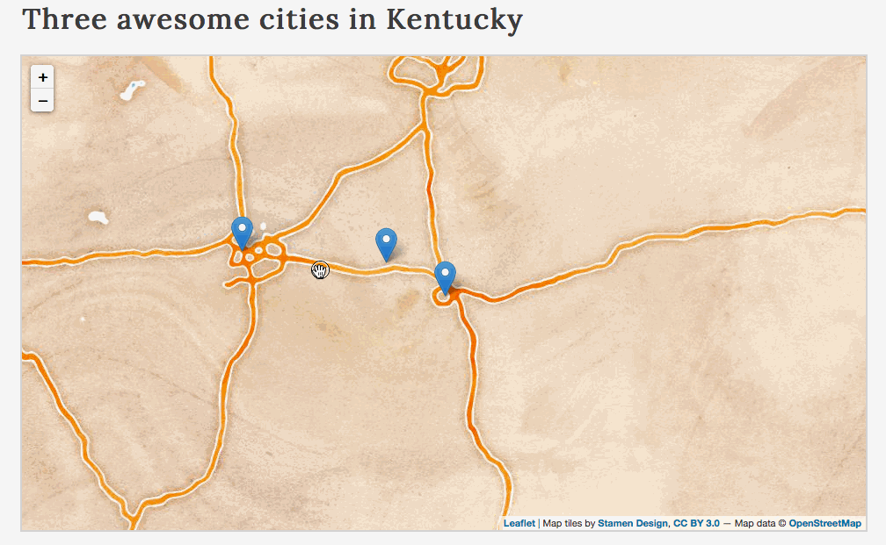
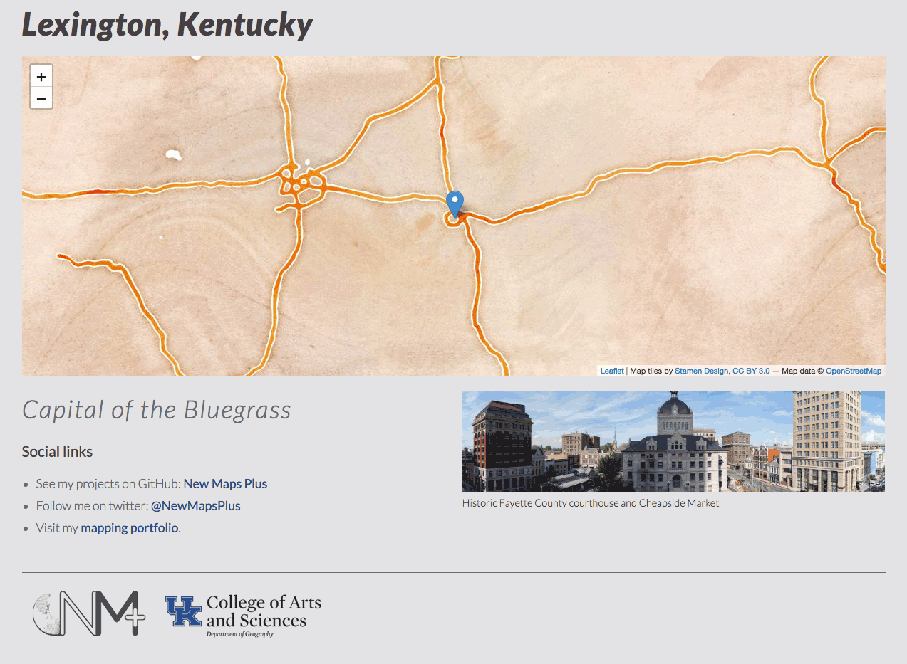

# Lab 02: Adding Markers for City Locations with Population Data

## Part I. Understanding the lesson (1 pt)

Run through the lesson *README.md* and use the *lesson-02/index.html* file to write/execute/test the statements presented in the lesson. Commit changes as you go and push the *index.html* to your GitHub repository. Provide comments describing what the code is doing.


## Part II. Lesson Quiz (3 pts)

Create a new file named *quiz-02.md* within your *map672-module-02-username/lab-02/* directory.

Answer the following questions and save them to the *quiz-02.md* file. Commit the file to your repository with a good commit message. Practice using [Markdown](https://github.com/adam-p/markdown-here/wiki/Markdown-Cheatsheet) to format your responses. For example, wrap JavaScript code blocks in triple backticks` ``` `. The first triple backticks are followed by `javascript   ` to tell Markdown which syntax to use, ` ```javascript `

Here is an example:

<pre>
```javascript

// JavaScript goes here.
console.log("Hello World!")

```
</pre>

### Quiz:

 1. Describe one implication of values having different data types.
 2. Print to the console the following line EXACTLY (including all quotes), "My cat's kitty car has "Hello Kitty" on it!"
 3. Explain why the output of the following statement is 88. `console.log(3 + 5 + "8");`.
 4. We know that JavaScript can interpret the numeric value of `5` to be equivalent to the string value of `"5"`. But then why does the following statement throw an error in the script? `console.log(5 = "5");`.
 5. Use this array ```var myMap = ["map","thousand","is","A","worth","a","pictures","."];``` to write a statement (using the array's index values and template strings) that unscrambles this sentence and outputs it to the Console.
 6. Write a statement for any `x` and `y` that compares their values. If `x` is the same as `y` then `console.log("equal")` and when `x` is greater than `y` then `console.log("x is greater than y")` and when `x` is less than `y` then `console.log("x is less than y")`. How do you handle the condition when the values cannot be compared?

## Part III. Storing and accessing map information using variables and arrays (6 pts)

This lab will create three markers for three different cities (anywhere in the world) and provide information about those cities with a popup window on a map. Popups are bound to markers and fire when a user clicks on the marker. In a previous lesson, we used a tooltip, which fires when a user hovers over a marker. The distinction is subtle but significant. A mobile or touchscreen user doesn't have a hover interaction, so popups are the best choice for usability. You can use both methods on a marker, though, to appeal to desktop users.

The final solution should look like this (with your geography of interest and a meaningful yet fun title and subtitle!):

  
*A solution for Lab 02*


### Instructions 

Modify the *index.html* within the *lab-02/* directory to fulfill the requirements listed below. You will need first to add the HTML and CSS you created in the previous module to finish this template. It is essential to know how to build a template from which to start web mapping.

The *lab-02/index.html* file contains some Leaflet code that you may not recognize yet, which is okay. For example, this code snippet covers JavaScript methods we haven't introduced yet:

```javascript
// create the Leaflet marker using the coordinates
L.marker(coords[0])
    .addTo(map) // add it to the map
    .bindPopup(city1Popup);  // bind the Popup
```

[Leaflet](http://leafletjs.com) makes our map work, and it will seem daunting at first to comprehend. Let's focus on the JavaScript fundamentals for now. With a good programming foundation, we can dive confidently into Leaflet and use its powerful capabilities.

After you finish the template in *lab-02/index.html*, view the rendered page within your web browser **using a local server**. You should see a single city, Lexington, represented by a marker that displays a popup when clicked or tapped.

You should also open your web developer toolbar and check the Console for any errors.

  
*The starter template for lab 02*

Review the JavaScript code between the two `<script></script>` tags at the bottom of the document.

The first five statements involve creating the Leaflet map with some base map tiles. You won't be editing this (unless you want to change base maps), but you will adjust the center lat/long values and the zoom level in the `options` variable:

```javascript
  // Map options control initial location and zoom level.
    var options = {
      center: [38.0489, -84.5025],
      zoom: 8
    }

    // Create Leaflet map with above options.
    var map = L.map('map', options);

    // Get basemap URL from Leaflet Providers
    var basemap_url = 'http://stamen-tiles-{s}.a.ssl.fastly.net/watercolor/{z}/{x}/{y}.{ext}'

    // Get basemap attributes from Leaflet Providers
    var basemap_attributes = {
      attribution: 'Map tiles by <a href="http://stamen.com">Stamen Design</a>, <a href="http://creativecommons.org/licenses/by/3.0">CC BY 3.0</a> &mdash; Map data &copy; <a href="http://www.openstreetmap.org/copyright">OpenStreetMap</a>',
      subdomains: 'abcd',
      minZoom: 1,
      maxZoom: 16,
      ext: 'png'
    }

    // Add tileset as a layer in our map. 
    var tiles = L.tileLayer(basemap_url, basemap_attributes).addTo(map);
  ```

  Next, we write several variables, all beginning with 'city1' and assigned various values. Note that we're not writing `var` for each one, because they are all separated by commas:

  ```javascript
// variables referencing data values
var city1Name = "Lexington", // string value
    city1Coords = [38.0297, -84.4947],  // array value
    city1Pop = 308428,  // numeric value
    city1Capital = false,  // boolean value
    city1State = "Kentucky";  // string value
```

Then, we create five arrays, each containing a variable from above as the zero index (the first item in the array):

```javascript
// arrays of data
var cities = [city1Name],  // city1Name is the zero index of the array
    coords = [city1Coords],
    populations = [city1Pop],
    capitals = [city1Capital],
    states = [city1State];
```

We then build a string containing HTML elements and text, which we'll use for the Popup content. See how we access the values using the arrays' zero index value:

```javascript
// creating a string of the Popupcontent
var city1Popup = `<b>${cities[0]}</b>
                  <br><b>population</b>: ${populations[0]}`;
```

For greater clarification, you could see what values the arrays are accessing with a console.log() statement:

```javascript
console.log(cities[0]);  // Lexington
console.log(populations[0]); // 308428

// creating a string of the Popup content
var city1Popup = `<b>${cities[0]}</b>
                  <br><b>population</b>: ${populations[0]}`;
```

We use an if statement to determine if the city is a capital city, and if so, we concatenate more information to that string using the `+=` operator:

```javascript
// if a city is a capital city
if (capitals[0] == true) {
    // concatenate a string to the existing string value
    city1Popup += `<br>Capital of ${states[0]}`;
}
```

Finally, we create our Leaflet marker, using the coordinates for the city from the `coords` array we created above:

```javascript
// create the Leaflet marker using the coordinates
L.marker(coords[0])
    .addTo(map) // add it to the map
    .bindPopup(city1Popup);  // bind the Popup
```

Your task is to modify this working example to meet the following requirements:

- [ ] Map contains at least three markers for different cities (anywhere in the world, within or across different states/countries)
- [ ] Map initially loads with all markers visible (i.e., the map center and zoom levels have been adjusted appropriately)
- [ ] Markers have popups `.bindPopup('string')`, and tooltips `.bindTooltip('string')` as well, that display:
  - [ ] name of the city
  - [ ] population of the city
  - [ ] (if) the city is a capital city
- [ ] Map title, subtitle, map info, and metadata (author, source) are updated
- [ ] JavaScript code is appropriately commented 
- [ ] The project is documented within Git using descriptive commit messages
- [ ] Use the [latest stable release of the Leaflet JS](https://leafletjs.com/download.html) and CSS files via a CDN (content delivery network) 

**How to proceed:**

1. Begin by choosing your three cities of interest and compiling the necessary data: lat/long values, the county/state/country it's in, etc.
2. Update the existing `city1` variables with data from one of the cities.
3. Add two more sets of data and begin those variable names with `city2` and `city3` (e.g., `city2Name = "Newark"`).
4. Add those two sets of variables to the existing five arrays (city2 in the first index and city3 in the second index).
5. Replicate the blocks of code that build the Popup information as a string, test to see if it's a capital, and create the Leaflet marker, for the other two cities.

Develop with your Console open in your browser's web developer tools. Make commits with useful messages as you hit milestones within the task, and push to the remote repository for periodic backups and to submit through Canvas when complete.

**Challenge: add images to your popup**

* Modify the style rules of the document (within the `<style></style>` tags at the top) to give the overall page a unique style (e.g., typeface, colors, hierarchy) appropriate to the mapped geography.
* Include an image or graphic in the HTML text below the map to help illustrate the nature of the mapped phenomena or intended message.
* Include an image or graphic in the popup (hint: use the `` tag when constructing the popups' string value and keep the image small).

## Challenge: adding destinations to your Vacation Map

Revisit your first module's repo and add at least two markers of significant locations to your Vacation map. This process is an excellent way to practice adding new content on a page that you have created.

Make sure you complete the following:

1. Declare variables for the `coords`, `locationName`, and `locationDetails` for each location.
2. Build a marker popup using the name and details for each city.

Use the following example code to build your popup:

```javascript
// Location marker code example
var location1popup = `<b>${location1Name}</b><br>
                      <b>Details</b>: ${location1Details}`;

L.marker(coords[0])
.addTo(map)
.bindPopup(location1popup);
```


